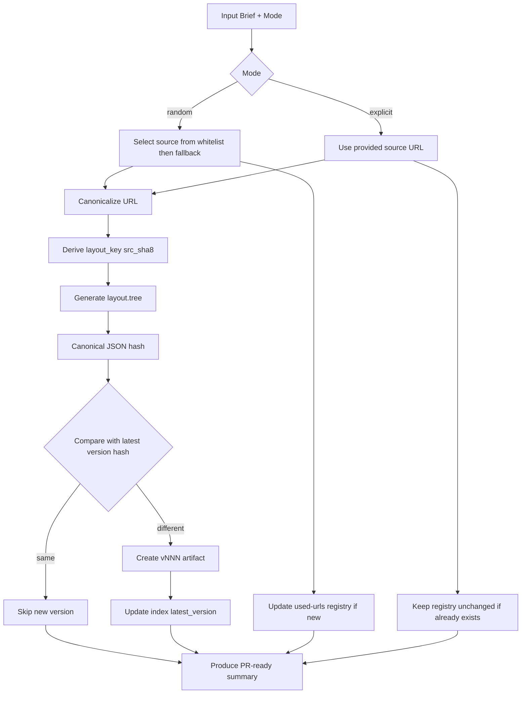

# AI Layout Generation and Catalog Governance

## Overview
Plan ini membangun fondasi operasional untuk command AI generator layout di `billing-themes` dengan model source uniqueness global, versioning per source URL, dan submit flow PR semi-otomatis tanpa backend submit orchestration.

## Problem Frame
Kita butuh cara terstandar untuk menghasilkan layout dari sumber internet secara konsisten, menjaga keunikan URL di random mode, mengizinkan regenerate explicit mode pada URL sama dengan versioning deterministic, dan tetap aman untuk repo public.

## Requirements Trace
- R1-R6: model path storage tenant single-active + katalog layout + source registry.
- R7-R10: source mode `random`/`explicit` dengan whitelist-first dan policy reuse.
- R11-R15: uniqueness global by canonical URL + hash-based versioning behavior.
- R16-R19: PR flow FE semi-otomatis + support `custom_layout` arbitrary + auto-promote ke katalog.
- R20-R23: CI guardrails schema/safety/path/complexity.

## Scope Boundaries
- Tidak membangun renderer FE.
- Tidak menambahkan auto-merge.
- Tidak membangun UI drag-drop editor.

## Context & Research

### Relevant Code and Patterns
- Repo saat ini masih minimal dan belum punya workflow CI atau script validator.
- Existing artifacts masih memakai struktur lama di `designs/tenants/abanet/manifest.json` dan `designs/tenants/abanet/versions/*.json`.
- Requirements dan contract baru sudah tersedia:
  - `docs/brainstorms/ai-layout-generation-command-requirements.md`
  - `docs/contracts/ai-layout-generation-command-contract.md`

### Institutional Learnings
- Belum ada `docs/solutions/` di repo ini; plan memakai requirements sebagai source utama.

### External References
- Tidak dipakai untuk pass ini; plan fokus lock-in contract internal repo.

## Key Technical Decisions
- Gunakan `layout_key = src_{sha8(canonical_url)}` untuk identitas keluarga layout.
- Gunakan `sha256(canonical_json(layout.tree))` untuk deteksi identik/berbeda antar versi.
- `random mode` memblok reuse URL permanen via registry.
- `explicit mode` boleh reuse URL, tetapi versi baru hanya dibuat jika hash tree berubah.
- Katalog tampil satu entry per `layout_key` di `catalog/layouts/index.json`, dengan `latest_version` pointer.
- Submit publish tetap lewat PR review; command hanya menghasilkan paket PR-ready.

## Open Questions

### Resolved During Planning
- Cara key layout: hash canonical URL, bukan URL mentah.
- Source uniqueness scope: global seluruh katalog.
- Registry model: file tunggal `catalog/source-registry/used-urls.json`.

### Deferred to Implementation
- Detail canonicalization URL (aturan host/path/query normalization final).
- Format exact field `preview` untuk card FE di `index.json`.
- Threshold final complexity limit (`max_depth`, `max_nodes`, `max_bytes`) setelah trial sample.

## High-Level Technical Design

> *This illustrates the intended approach and is directional guidance for review, not implementation specification. The implementing agent should treat it as context, not code to reproduce.*

## Implementation Units

- [ ] **Unit 1: Repository Contract Migration**

**Goal:** Menyelaraskan struktur repo dari model lama (`manifest` + `versions` tenant) ke model baru single-active tenant + shared layout catalog.

**Requirements:** R1-R6, R16-R19

**Dependencies:** None

**Files:**
- Create: `catalog/layouts/index.json`
- Create: `catalog/source-registry/used-urls.json`
- Modify: `README.md`
- Modify: `designs/tenants/abanet/active-theme.json`
- Remove/deprecate reference: `designs/tenants/abanet/manifest.json`
- Remove/deprecate reference: `designs/tenants/abanet/versions/v20260416-001.json`
- Remove/deprecate reference: `designs/tenants/abanet/versions/v20260416-002.json`
- Test: `tests/contract/migration_contract_test.py`

**Approach:**
- Definisikan struktur baru sebagai source-of-truth di README.
- Tambahkan scaffolding katalog + registry kosong tapi valid schema.
- Tandai artifact legacy sebagai deprecated dan berhenti dipakai oleh contract baru.

**Patterns to follow:**
- Contract clarity dari `docs/contracts/ai-layout-generation-command-contract.md`.

**Test scenarios:**
- Happy path: struktur baru tersedia dan file wajib bisa dibaca.
- Edge case: registry kosong tetap valid.
- Integration: tenant active masih dapat menyimpan `custom_layout` tanpa ketergantungan ke file `versions` lama.

**Verification:**
- Repo tree merefleksikan contract baru dan tidak ambigu antara model lama vs baru.

- [ ] **Unit 2: Schema and Validation Foundation**

**Goal:** Menyediakan schema untuk semua artifact dan validator lokal/CI.

**Requirements:** R20-R23

**Dependencies:** Unit 1

**Files:**
- Create: `schemas/tenant-active-theme.schema.json`
- Create: `schemas/layout-version.schema.json`
- Create: `schemas/layout-index.schema.json`
- Create: `schemas/source-registry.schema.json`
- Create: `scripts/validate_artifacts.py`
- Test: `tests/validation/test_artifact_schema.py`

**Approach:**
- Lock required fields, allowed enums, dan deny unknown high-risk fields.
- Validator memeriksa schema + complexity constraints.

**Patterns to follow:**
- Safety policy di `README.md`.

**Test scenarios:**
- Happy path: semua file valid lolos validator.
- Edge case: missing required field gagal dengan error jelas.
- Error path: `custom_layout` depth melebihi limit ditolak.
- Integration: gabungan file tenant + catalog + registry tervalidasi dalam satu run.

**Verification:**
- Validator dapat dipakai sebagai CI gate deterministik.

- [ ] **Unit 3: Source Canonicalization and Uniqueness Engine**

**Goal:** Menentukan canonical URL, `layout_key`, dan policy random/explicit secara deterministic.

**Requirements:** R7-R12

**Dependencies:** Unit 2

**Files:**
- Create: `scripts/lib/source_canonicalizer.py`
- Create: `scripts/lib/source_registry.py`
- Create: `scripts/lib/layout_identity.py`
- Test: `tests/generation/test_source_uniqueness.py`

**Approach:**
- Implement canonicalization rule set (strip tracking params, normalize host/path).
- Implement lookup/update registry behavior per mode.
- Derive `layout_key` from canonical URL hash.

**Patterns to follow:**
- Key derivation rules di `docs/contracts/ai-layout-generation-command-contract.md`.

**Test scenarios:**
- Happy path: URL baru random mode diterima dan tercatat di registry.
- Edge case: URL dengan query tracking berbeda tetap canonical key sama.
- Error path: random mode dengan URL existing harus fail fast.
- Integration: explicit mode URL existing tetap lanjut generation.

**Verification:**
- Uniqueness decision konsisten di semua run.

- [ ] **Unit 4: Layout Versioning and Index Updater**

**Goal:** Menjalankan hash compare, menentukan skip/create version, dan memperbarui `index.json` tanpa menggandakan entry family.

**Requirements:** R13-R15

**Dependencies:** Unit 3

**Files:**
- Create: `scripts/lib/layout_hash.py`
- Create: `scripts/lib/layout_versioning.py`
- Modify: `catalog/layouts/index.json`
- Test: `tests/generation/test_versioning_behavior.py`

**Approach:**
- Gunakan canonical serializer untuk `layout.tree`.
- Compare hash dengan latest version per `layout_key`.
- Jika beda, create `vNNN` baru dan update `latest_version`; jika sama, no-op.

**Patterns to follow:**
- Versioning rules dari origin requirements (see origin: `docs/brainstorms/ai-layout-generation-command-requirements.md`).

**Test scenarios:**
- Happy path: explicit regenerate beda hash membuat `vNNN+1`.
- Edge case: version numbering tetap urut walau ada gap file historis.
- Error path: index missing family entry saat versioning harus menghasilkan error recoverable.
- Integration: explicit regenerate identik tidak membuat file baru dan index tidak berubah.

**Verification:**
- Riwayat version family konsisten dan deterministic.

- [ ] **Unit 5: PR-Ready Command Output Pack**

**Goal:** Menyediakan command internal yang menghasilkan artifact + metadata untuk flow GitHub UI `Propose changes`.

**Requirements:** R16-R18

**Dependencies:** Unit 4

**Files:**
- Create: `scripts/generate_layout_candidate.py`
- Create: `templates/pr/layout-pr-template.md`
- Create: `docs/ops/layout-command-usage.md`
- Test: `tests/generation/test_pr_output_bundle.py`

**Approach:**
- Command menerima mode + brief input.
- Output bundle berisi file patch candidates, branch suggestion, commit message suggestion, dan PR body.

**Patterns to follow:**
- Contract I/O di `docs/contracts/ai-layout-generation-command-contract.md`.

**Test scenarios:**
- Happy path: random mode menghasilkan bundle lengkap untuk PR.
- Edge case: explicit mode URL existing tetap menghasilkan bundle valid.
- Error path: input missing required fields menghasilkan validation error terstruktur.
- Integration: output bundle sinkron dengan schema validator.

**Verification:**
- Operator bisa langsung copy hasil ke GitHub UI tanpa menyusun metadata manual.

- [ ] **Unit 6: Auto-Promote and Governance CI**

**Goal:** Menjalankan auto-promote custom layout tenant ke katalog serta enforce guardrail CI.

**Requirements:** R19-R23

**Dependencies:** Unit 5

**Files:**
- Create: `.github/workflows/validate-artifacts.yml`
- Create: `.github/workflows/auto-promote-custom-layout.yml`
- Create: `.github/pull_request_template.md`
- Create: `docs/ops/layout-review-checklist.md`
- Test: `tests/ci/test_guardrail_rules.py`

**Approach:**
- Workflow validasi selalu jalan di PR.
- Workflow auto-promote berjalan setelah merge perubahan tenant active dan memproses `custom_layout` menjadi catalog family/version.
- Enforce tenant path guard + tenant_code match + safety scan + complexity limits.

**Patterns to follow:**
- Guardrail intent dari requirements (see origin: `docs/brainstorms/ai-layout-generation-command-requirements.md`).

**Test scenarios:**
- Happy path: PR valid lolos semua gate.
- Edge case: PR menyentuh dua tenant path ditolak.
- Error path: payload memuat field sensitif/PII ditolak.
- Integration: merge tenant active dengan custom layout memicu auto-promote katalog dengan index update benar.

**Verification:**
- Governance otomatis mencegah publish artifact berbahaya/invalid.

## System-Wide Impact
- **Interaction graph:** Generator command -> schema validator -> source registry -> catalog index -> PR workflow.
- **Error propagation:** Invalid source/schema/safety harus fail sebelum output PR bundle dipakai.
- **State lifecycle risks:** Registry tunggal berpotensi conflict merge; mitigasi dengan deterministic sort + idempotent write.
- **API surface parity:** FE browse contract harus tetap kompatibel saat `index.json` berevolusi.
- **Integration coverage:** Perlu integration test antara versioning engine dan index updater.
- **Unchanged invariants:** Tenant config tetap single active JSON dan publish ke `main` tetap lewat review PR.

## Risks & Dependencies

| Risk | Mitigation |
|------|------------|
| Registry file tunggal sering conflict | Deterministic ordering, minimal patch scope, dan retry merge policy |
| Layout AI terlalu kompleks | Enforce depth/node/size limits di validator dan CI |
| Random source kualitas rendah saat fallback internet umum | Prioritaskan whitelist, tambahkan review checklist kualitas |
| Auto-promote menghasilkan noise katalog | Tetap review PR mandatory dan metadata provenance wajib |

## Documentation / Operational Notes
- Dokumentasi operator command harus menjelaskan perbedaan `random` vs `explicit` mode.
- Review checklist wajib mencakup legal/similarity sanity check untuk source-based adaptation.

## Sources & References
- **Origin document:** [docs/brainstorms/ai-layout-generation-command-requirements.md](docs/brainstorms/ai-layout-generation-command-requirements.md)
- Contract reference: [docs/contracts/ai-layout-generation-command-contract.md](docs/contracts/ai-layout-generation-command-contract.md)
- Existing repository policy: [README.md](README.md)
